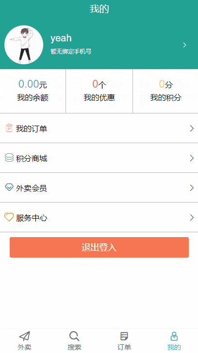
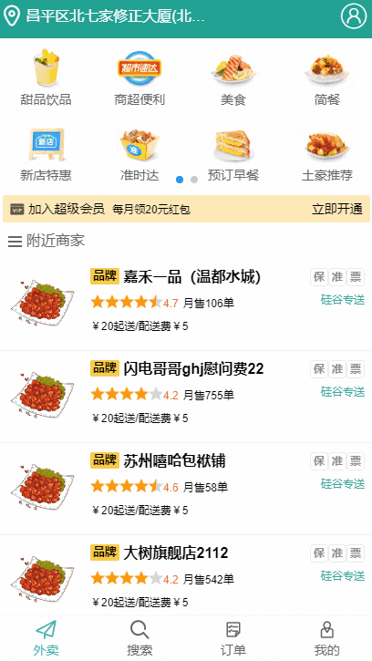

### 项目简单介绍

---

模仿饿了么外卖，使用vue-cli3脚手架，前端使用vue+vuex+vueRouter+axios，为了模拟真正的前后端分离，做到真实的数据交互，使用express搭建了后端，数据库使用noSQL类型的mongodb方便存取数据，同时利用mock拦截部分请求返回数据；功能设计登录、注册、浏览商品、购物车、个人信息修改等 

### 项目展示图

  

### 项目运行

1. 先在命令行中进入`waimai-server`文件，然后运行以下命令

   ```node
   npm install  // 下载package.json中的所有模块
   npm start   // 运行项目，当出现‘连接数据库成功’说明成功启动服务器
   ```

2. 然后命令行中进入`waimai-client`文件，运行以下命令

   ```node
   npm install
   npm run serve
   ```

### 从中收获如下

##### 项目开发流程及开发方法 

1. 熟悉一个项目的开发流程
2. 学会组件化、模块化、工程化的开发模式 
3. 掌握使用 vue-cli 脚手架初始化 Vue.js 项目
4. 学会模拟 json 后端数据，实现前后端分离开发 
5. 学会 ES6+eslint 的开发方式 
6. 掌握一些项目优化技巧 

##### 以下Vue 插件及第三方插件库

1. 学会使用 vue-router 开发单页应用 
2. 学会使用 axios 与后端进行数据交互
3. 学会使用 vuex 管理应用组件状态
4. 学会使用 vue-pull-to 实现轮播图下效果
5. 学会使用 better-scroll/vue-scroller 实现页面滑动效果
6. 学会使用 mockjs 模拟后台数据接口  

### api数据接口文档

[项目API接口文档](https://github.com/W-Qing/Vue-MintShop/blob/master/mintshop-server/API.md)
